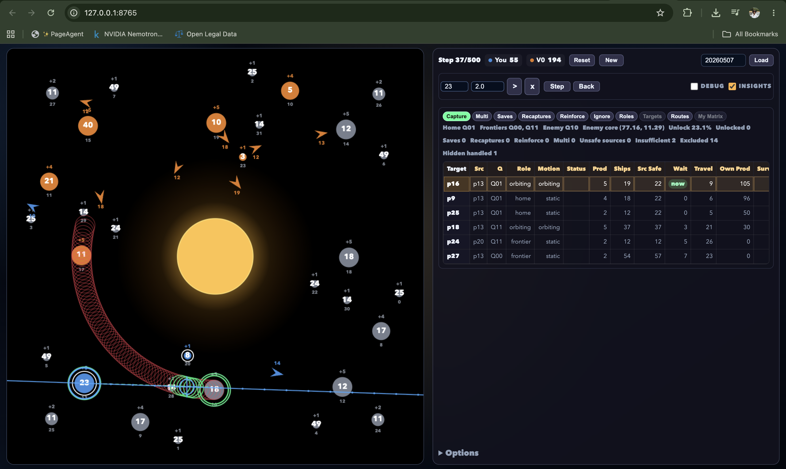

<p align="center">
  <a href="https://www.kaggle.com/competitions/orbit-wars">
    
  </a>
</p>

<h1 align="center">Orbit Wars</h1>

<p align="center">
  <strong>1100+ ELO Kaggle Orbit Wars agent</strong><br />
  A replay-trained, GPU-ready strategy agent for continuous-space real-time strategy.
</p>

<p align="center">
  <a href="https://www.kaggle.com/competitions/orbit-wars">Competition</a>
  &nbsp;&middot;&nbsp;
  <a href="notebooks/rl_ppo.ipynb">PPO notebook</a>
  &nbsp;&middot;&nbsp;
  <a href="agents/main.py">Agent</a>
</p>

<p align="center">
  
  
  
</p>

## Built With

| Area | Stack used in this repository |
| --- | --- |
| Learning | Behavior cloning from high-quality replays, reinforcement learning, and Proximal Policy Optimization (PPO) self-play |
| Deep learning | PyTorch policy/value models and entity-oriented feature representations |
| Parallel execution | Batched PyTorch tensor planning on CUDA-capable devices; parallel PPO environments; multiprocessing replay-feature extraction |
| Performance | Numba-compiled physics, formula, and vectorized-geometry kernels |
| Data | Kaggle replay JSON, Parquet, PyArrow, Pandas, Polars, NumPy, and ORJSON |
| Environment | Kaggle Environments, Python 3.11+, and UV |

## Project Highlights

- **1100+ ELO agent** built for the Kaggle Orbit Wars competition.
- **Replay-to-policy workflow**: collect leader-board replays, extract entity and physics features, then train imitation and RL policies.
- **PPO self-play**: the training notebook collects rollouts from multiple environments in parallel and periodically synchronizes its self-play opponent.
- **GPU-ready planning**: the deployed agent uses PyTorch tensors and keeps computations device-consistent across CPU and CUDA.
- **Physics-aware decisions**: orbit prediction, comet paths, fleet intercepts, collision checks, capture sizing, and reinforcement timing inform each launch.
- **Visual strategy gym**: run seeded games in a browser to inspect decisions, replay turns, and pressure-test strategies before submitting.

## Repository Map

| Path | Purpose |
| --- | --- |
| [`agents/main.py`](agents/main.py) | Main Torch-based competition agent |
| [`agents/orbit_lite/`](agents/orbit_lite/) | Compact tensor planner and Kaggle adapter |
| [`imitate/`](imitate/) | Replay feature extraction for behavior cloning |
| [`notebooks/rl_ppo.ipynb`](notebooks/rl_ppo.ipynb) | PPO self-play training and evaluation workflow |
| [`gym.py`](gym.py) | Browser-based visual strategy gym for AI-vs-AI experiments and AI-vs-human gameplay |
| [`data/`](data/) | Downloaded leaderboard snapshots and replay data |

## Quick Start

```bash
uv sync
uv run python -m imitate.features.feature_engine \
  --input data/batch/batch-1.parquet \
  --workers auto
```

Feature extraction prints progress as it streams Parquet batches, uses multiprocessing for independent snapshots, and uses the available Numba kernels automatically.

For PPO training, open [`notebooks/rl_ppo.ipynb`](notebooks/rl_ppo.ipynb) in Kaggle or Jupyter. Set the notebook device to `cuda` when a GPU is available; the public configuration starts with multiple parallel environments and can be scaled for longer runs.

## Visual Strategy Gym

[`gym.py`](gym.py) is the practical testing ground for strategy work. It runs the game in a local browser UI, making it easy to validate a plan before it reaches a competition submission.

<p align="center">
  
</p>

- **AI vs AI**: compare agents or strategy variants under the same seed and watch how their openings, reinforcements, captures, and endgames diverge.
- **AI vs human**: play directly against a local agent, choose your seat, aim launches on the board, and inspect the agent's decisions turn by turn.
- **Visual debugging**: review live board state, candidate and opening analysis, movement paths, turn history, deterministic seeds, and saved local game episodes.

```bash
uv run python gym.py --agent v0 --seed 20260507
```

The server prints the local URL as it starts and reloads automatically when the game or agent code changes. Use `--seat second` to play from the other starting position, or pass `--agent path/to/agent.py` to test a different local agent.

---

## Game Reference

Conquer planets rotating around a sun in continuous 2D space. A real-time strategy game for 2 or 4 players.

## Overview

Players start with a single home planet and compete to control the map by sending fleets to capture neutral and enemy planets. The board is a 100x100 continuous space with a sun at the center. Planets orbit the sun, comets fly through on elliptical trajectories, and fleets travel in straight lines. The game lasts 500 turns. The player with the most total ships (on planets + in fleets) at the end wins.

## Board Layout

- **Board**: 100x100 continuous space, origin at top-left.
- **Sun**: Centered at (50, 50) with radius 10. Fleets that cross the sun are destroyed.
- **Symmetry**: All planets and comets are placed with 4-fold mirror symmetry around the center: (x, y), (100-x, y), (x, 100-y), (100-x, 100-y). This ensures fairness regardless of starting position.

## Planets

Each planet is represented as `[id, owner, x, y, radius, ships, production]`.

- **owner**: Player ID (0-3), or -1 for neutral.
- **radius**: Determined by production: `1 + ln(production)`. Higher production planets are physically larger.
- **production**: Integer from 1 to 5. Each turn, an owned planet generates this many ships.
- **ships**: Current garrison. Starts between 5 and 99 (skewed toward lower values).

### Planet Types

- **Orbiting planets**: Planets whose `orbital_radius + planet_radius < 50` rotate around the sun at a constant angular velocity (0.025-0.05 radians/turn, randomized per game). Use `initial_planets` and `angular_velocity` from the observation to predict their positions.
- **Static planets**: Planets further from the center do not rotate.

The map contains 20-40 planets (5-10 symmetric groups of 4). At least 3 groups are guaranteed to be static, and at least one group is guaranteed to be orbiting.

### Home Planets

One symmetric group is randomly chosen as the starting planets. In a 2-player game, players start on diagonally opposite planets (Q1 and Q4). In a 4-player game, each player gets one planet from the group. Home planets start with 10 ships.

## Fleets

Each fleet is represented as `[id, owner, x, y, angle, from_planet_id, ships]`.

- **angle**: Direction of travel in radians.
- **ships**: Number of ships in the fleet (does not change during travel).

### Fleet Speed

Fleet speed scales with size on a logarithmic curve:

```
speed = 1.0 + (maxSpeed - 1.0) * (log(ships) / log(1000)) ^ 1.5
```

- 1 ship moves at 1.0 units/turn.
- Larger fleets move faster, approaching the maximum speed (default 6.0).
- A fleet of ~500 ships moves at ~5, and ~1000 ships reaches the max.

### Fleet Movement

Fleets travel in a straight line at their computed speed each turn. A fleet is removed if it:

- Goes out of bounds (leaves the 100x100 playing field).
- Crosses the sun (path segment comes within the sun's radius).
- Collides with any planet (path segment comes within the planet's radius). This triggers combat.

Collision detection is continuous -- the entire path segment from old to new position is checked, not just the endpoint.

### Fleet Launch

Each turn, your agent returns a list of moves: `[from_planet_id, direction_angle, num_ships]`.

- You can only launch from planets you own.
- You cannot launch more ships than the planet currently has.
- The fleet spawns just outside the planet's radius in the given direction.
- You can issue multiple launches from the same or different planets in a single turn.

## Comets

Comets are temporary extra-solar objects that fly through the board on highly elliptical orbits around the sun. They spawn in groups of 4 (one per quadrant) at steps 50, 150, 250, 350, and 450.

- **Radius**: 1.0 (fixed).
- **Production**: 1 ship/turn when owned.
- **Starting ships**: Random, skewed low (minimum of 4 rolls from 1-99). All 4 comets in a group share the same starting ship count.
- **Speed**: Configurable via `cometSpeed` (default 4.0 units/turn).
- **Identification**: Check `comet_planet_ids` in the observation to see which planet IDs are comets. Comets also appear in the `planets` array and follow all normal planet rules (capture, production, fleet launch, combat).

When a comet leaves the board, it is removed along with any ships garrisoned on it. Comets are removed before fleet launches each turn, so you cannot launch from a departing comet.

The `comets` observation field contains comet group data including `paths` (the full trajectory for each comet) and `path_index` (current position along the path), which can be used to predict future comet positions.

## Turn Order

Each turn executes in this order:

1. **Comet expiration**: Remove comets that have left the board.
2. **Comet spawning**: Spawn new comet groups at designated steps.
3. **Fleet launch**: Process all player actions, creating new fleets.
4. **Production**: All owned planets (including comets) generate ships.
5. **Fleet movement**: Move all fleets along their headings. Check for out-of-bounds, sun collision, and planet collision. Fleets that hit planets are queued for combat.
6. **Planet rotation & comet movement**: Orbiting planets rotate, comets advance along their paths. Any fleet caught by a moving planet/comet is swept into combat with it.
7. **Combat resolution**: Resolve all queued planet combats.

## Combat

When one or more fleets collide with a planet (either by flying into it or being swept by a moving planet), combat is resolved:

1. All arriving fleets are grouped by owner. Ships from the same owner are summed.
2. The largest attacking force fights the second largest. The difference in ships survives.
3. If there is a surviving attacker:
   - If the attacker is the same owner as the planet, the surviving ships are added to the garrison.
   - If the attacker is a different owner, the surviving ships fight the garrison. If the attackers exceed the garrison, the planet changes ownership and the garrison becomes the surplus.
4. If two attackers tie, all attacking ships are destroyed (no survivors).

## Scoring and Termination

The game ends when:

- **Step limit reached**: 500 turns.
- **Elimination**: Only one player (or zero) remains with any planets or fleets.

Final score = total ships on owned planets + total ships in owned fleets. Highest score wins.

## Observation Reference

| Field                  | Type                                                     | Description                             |
| ---------------------- | -------------------------------------------------------- | --------------------------------------- |
| `planets`              | `[[id, owner, x, y, radius, ships, production], ...]`    | All planets including comets            |
| `fleets`               | `[[id, owner, x, y, angle, from_planet_id, ships], ...]` | All active fleets                       |
| `player`               | `int`                                                    | Your player ID (0-3)                    |
| `angular_velocity`     | `float`                                                  | Planet rotation speed (radians/turn)    |
| `initial_planets`      | `[[id, owner, x, y, radius, ships, production], ...]`    | Planet positions at game start          |
| `comets`               | `[{planet_ids, paths, path_index}, ...]`                 | Active comet group data                 |
| `comet_planet_ids`     | `[int, ...]`                                             | Planet IDs that are comets              |
| `remainingOverageTime` | `float`                                                  | Remaining overage time budget (seconds) |

## Action Format

Return a list of moves:

```python
[[from_planet_id, direction_angle, num_ships], ...]
```

- `from_planet_id`: ID of a planet you own.
- `direction_angle`: Angle in radians (0 = right, pi/2 = down).
- `num_ships`: Integer number of ships to send.

Return an empty list `[]` to take no action.

## Agent Convenience

The module exports named tuples for easier field access:

```python
from kaggle_environments.envs.orbit_wars.orbit_wars import Planet, Fleet, CENTER, ROTATION_RADIUS_LIMIT

def agent(obs):
    planets = [Planet(*p) for p in obs.get("planets", [])]
    fleets = [Fleet(*f) for f in obs.get("fleets", [])]
    player = obs.get("player", 0)

    for p in planets:
        print(p.id, p.owner, p.x, p.y, p.radius, p.ships, p.production)

    return []  # list of [from_planet_id, angle, num_ships]
```

## Configuration

| Parameter      | Default | Description              |
| -------------- | ------- | ------------------------ |
| `episodeSteps` | 500     | Maximum number of turns  |
| `actTimeout`   | 1       | Seconds per turn         |
| `shipSpeed`    | 6.0     | Maximum fleet speed      |
| `sunRadius`    | 10.0    | Radius of the sun        |
| `boardSize`    | 100.0   | Board dimensions         |
| `cometSpeed`   | 4.0     | Comet speed (units/turn) |

## Implementation Notes

The training path begins with replay data: high-quality games are stored as JSON and compacted into Parquet snapshots. The feature engine derives direct state, formulas, player-relative views, aggregates, vectorized geometry, and physics features. Its independent snapshots are distributed across worker processes, while Numba accelerates the computationally dense kernels.

The PPO notebook uses self-play with an MLP policy/value network. Each owned planet is treated as a decision point, with candidate targets represented as structured features. The agent learns target selection while the environment rules determine valid fleet launches and movement.

At inference time, the competition agent emphasizes deterministic, physics-aware planning: it evaluates capture costs, moving targets, comet timing, reinforcements, and future garrison states before emitting legal moves.
